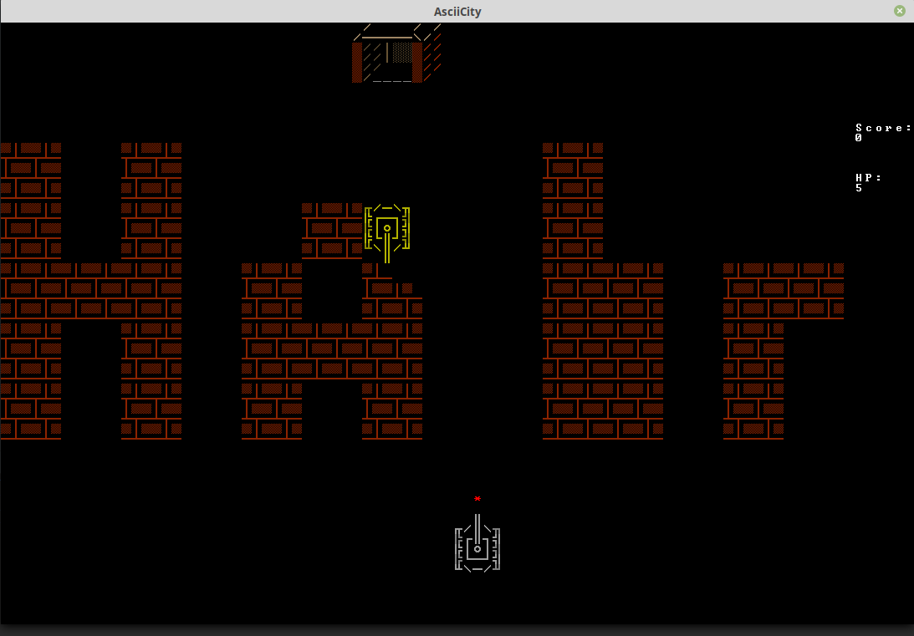

## ASCIIcity

An ASCII-art Battle City clone.

## Installation and launch

1. Install [bear_hug](https://github.com/synedraacus/bear_hug) either through
pip or manually. Requires Python 3.6+.
2. Download/clone this repository.
3. Launch `game.py` 